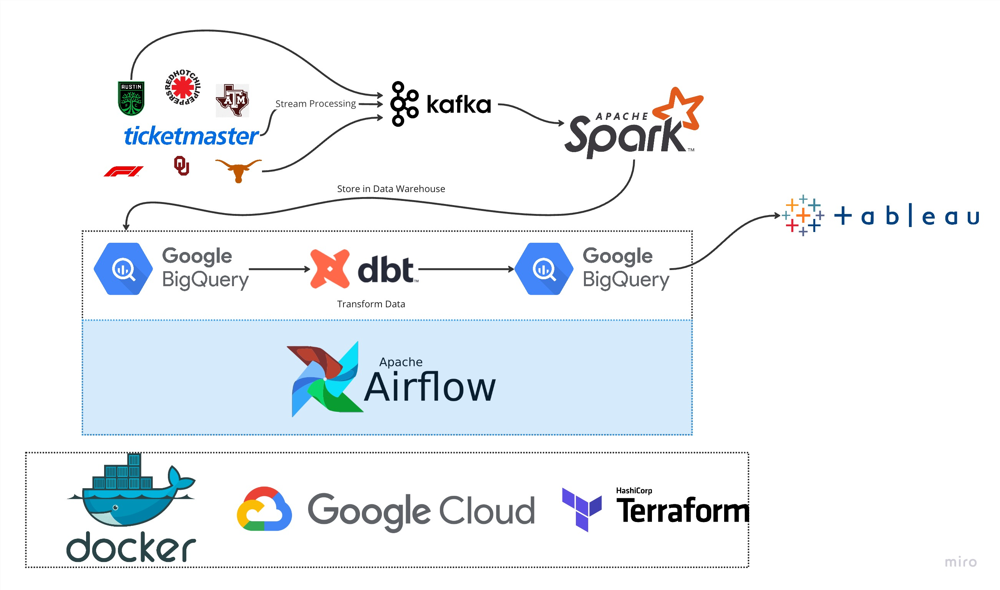
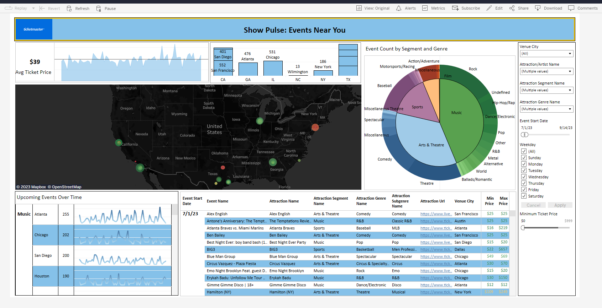

# ShowPulse

## Description
A data pipeline with Kafka, Spark Streaming, dbt, Docker, Airflow, and GCP!

### Objective

This project uses the Ticketmaster API to collect, transform and then visualize information on events happening in a given city in real time! The data is pre-processed & appended to a BigQuery data warehouse and then a batch job further processes the data and turns it into the desired tables for my dashboard. Using this dashboard, we will be able to show upcoming events in cities, compare the different segments of events happening in cities, and find good deals on far-out events. 

### Dataset

[Ticketmaster](https://developer.ticketmaster.com/) is an API that fetches data about to events (concerts, sporting events, etc) going on around the world. I figured ticketmaster would have most large events, and we could use this data to know when tickets for a show are being released and be the first to get them.

### Tools & Technologies

- Cloud - [**Google Cloud Platform**](https://cloud.google.com)
- Infrastructure as Code software - [**Terraform**](https://www.terraform.io)
- Containerization - [**Docker**](https://www.docker.com), [**Docker Compose**](https://docs.docker.com/compose/)
- Stream Processing - [**Kafka**](https://kafka.apache.org), [**Spark Streaming**](https://spark.apache.org/docs/latest/streaming-programming-guide.html)
- Orchestration - [**Airflow**](https://airflow.apache.org)
- Transformation - [**dbt**](https://www.getdbt.com)
- Data Lake - [**Google Cloud Storage**](https://cloud.google.com/storage)
- Data Warehouse - [**BigQuery**](https://cloud.google.com/bigquery)
- Data Visualization - [**Tableau**](https://www.tableau.com/)
- Language - [**Python**](https://www.python.org)

### Architecture

### Final Result

## Setup

**WARNING: You will be charged for all the infrastructure setup. If you sign up for a Google Cloud account you will start with a  $300 credit.**
### Pre-requisites

If you already have a Google Cloud account and a working terraform setup, you can skip the pre-requisite steps.

- Google Cloud Platform. 
  - GCP Account and Access Setup
  - [gcloud alternate installation method - Windows](https://github.com/DataTalksClub/data-engineering-zoomcamp/blob/main/week_1_basics_n_setup/1_terraform_gcp/windows.md#google-cloud-sdk)
- Terraform
  - [Setup Terraform](https://github.com/DataTalksClub/data-engineering-zoomcamp/blob/main/week_1_basics_n_setup/1_terraform_gcp/windows.md#terraform)

### Get Going!

- Set up infrastructure in GCP, including storage buckets, and bigquery.
- Install dependencies needed to run Spark and Kafka
- Run Startup Scripts

### How can I make this better?!
- Add more data about the artist/attraction (like Spotify plays per month, avg ticket price) and then call out great deals
- Choose managed infrastructure like Cloud Composer for Airflow, Dataproc for Spark and Confluent Cloud for Kafka
- Optimize the Kafka, Spark & dbt streaming setup 
- Build dimensions and facts incrementally instead of full refresh
- Create more dimensional models
- Include CI/CD
- Include Terraform and the infrastructure setup
- Add more visualizations
- Add more instructions to this repo

### Special Mentions
I learned this all thanks to [DataTalks.Club](https://datatalks.club)!! Thank you so much for offering this Data Engineering course for completely free. All the things I learned there, enabled me to come up with this project. I had little to no experience with most of these technologies before, and it really helped me gain a better understanding. If you want to upskill on Data Engineering technologies, please check out the [course](https://github.com/DataTalksClub/data-engineering-zoomcamp)!
